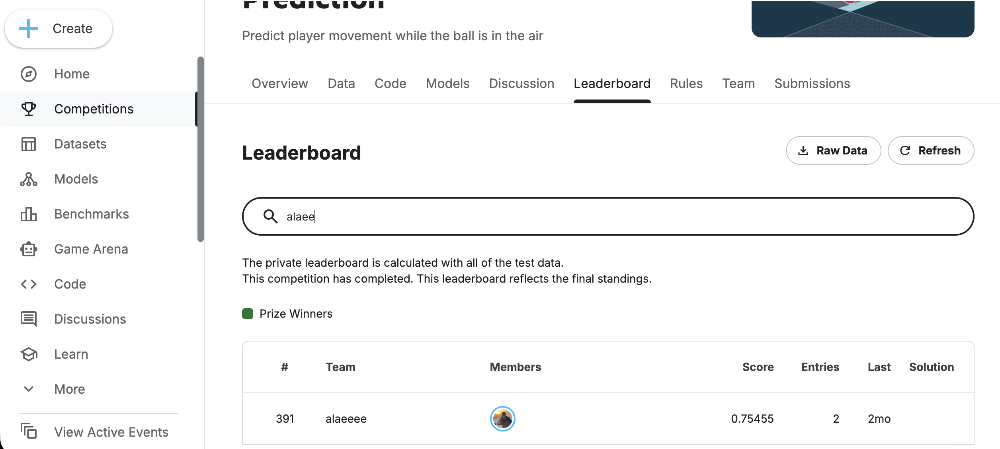

 # 🏈 NFL Player Movement Prediction  
*Kaggle – Big Data Bowl 2026*

Predicting NFL player trajectories while the ball is in the air using spatiotemporal tracking data.

This repository showcases a **full, production-style machine learning pipeline** built on real-world sports data (10 Hz tracking). It demonstrates how to transform raw movement data into predictive models using **physics-inspired feature engineering** and **time-aware validation**.

**Author:** Tanjim Hossain  
*MSc Data Science / Computer Science & Engineering*

---

## 🔍 Problem

Given player tracking data **before** the quarterback throws a pass, predict each player’s future **(x, y)** position while the ball is in the air.

Each prediction is identified by:

- `game_id`, `play_id`
- `nfl_id` (player)
- `frame_id` (after the throw)

**Metric:** 2D RMSE (yards)

---

## 🧠 Approach

This project follows an industry-style ML workflow:

1. **Play Normalization**  
   All plays are transformed so the offense moves left → right.

2. **Target Design**  
   Predict *displacement* instead of absolute position:  
   \[
   \Delta x = x_{future} - x_{throw}, \quad \Delta y = y_{future} - y_{throw}
   \]

3. **Feature Engineering**
   - History (pre-throw): velocity, acceleration, direction variability
   - Kinematics (throw frame): speed, acceleration, velocity components
   - Ball geometry: distance & angle to landing point, required speed
   - Field constraints: distances to sidelines and endzone
   - Context: role, position, side (one-hot), biometrics

4. **Modeling**
   - Two regressors per model: one for Δx, one for Δy
   - Final model: **XGBoost ensemble**
   - Compared with: Constant-Velocity, LightGBM, CatBoost, LSTM

5. **Validation**
   - Time-based cross-validation by week to avoid leakage  
     - Train 1–12 → Validate 13–15  
     - Train 1–15 → Validate 16–17  
     - Train 1–17 → Validate 18  
   - Fold models are ensembled at inference

---

## 🚀 Results

| Model                     | 2D RMSE (yards) |
|---------------------------|-----------------|
| Constant Velocity Baseline| ~8.0            |
| LSTM Sequence Model       | ~2.5            |
| LightGBM (tuned)          | ~1.52           |
| CatBoost (tuned)          | ~1.51           |
| **XGBoost Ensemble (final)** | **~1.14**   |

- **Kaggle Public Score:** ~0.77  
- **Public Leaderboard Rank:** ~790  

The XGBoost ensemble achieves the best trade-off between accuracy, stability, and efficiency.

---

## 🏆 Leaderboard Snapshot

<p align="center">
  
</p>

---

## 📁 Repository Structure

```text
nfl-player-movement-prediction/
├── notebooks/                 # EDA and model development
│   ├── 01_eda.ipynb
│   ├── 02_feature_engineering.ipynb
│   ├── 03_xgboost.ipynb
│   ├── 04_lightgbm.ipynb
│   └── 05_catboost.ipynb
│
├── src/                       # Reusable pipeline code
│   ├── preprocessing.py
│   ├── features.py
│   ├── models.py
│   ├── validation.py
│   └── inference.py
│
├── reports/                   # Academic documentation
│   └── project_report.pdf
│
├── assets/                    # Images (leaderboard, diagrams)
│   └── leaderboard.png
│
├── data/
│   └── README.md              # Instructions for obtaining Kaggle data
│
├── requirements.txt
└── README.md

## 🛠 Tech Stack

- Python, NumPy, Pandas  
- XGBoost, LightGBM, CatBoost  
- Scikit-learn  
- Kaggle Inference API  

---

## 📦 Data Access

The dataset is provided by Kaggle:

> NFL Big Data Bowl 2026  
> https://www.kaggle.com/competitions/nfl-big-data-bowl-2026

Due to Kaggle’s data usage policy, raw data is **not** included in this repository.  
After downloading, place the files in:

```text
data/raw/
├── train_tracking_week_1.csv
├── train_tracking_week_2.csv
├── ...
├── train_tracking_week_18.csv
├── train_labels_week_1.csv
├── train_labels_week_2.csv
├── ...
├── train_labels_week_18.csv
├── players.csv
├── plays.csv
└── games.csv


All notebooks and scripts assume this directory structure.  
Paths are relative to the project root (`data/raw/train_tracking_week_1.csv`)

---

## 🎯 Why This Project Matters

This repository demonstrates:

- End-to-end ML system design on real spatiotemporal data  
- Physics-aware feature engineering  
- Proper handling of temporal structure and data leakage  
- Model comparison and bias–variance trade-offs  
- Production-style inference pipeline  

It reflects how I approach machine learning problems:  
**understand the domain → engineer meaningful features → validate correctly → deploy robustly.**
